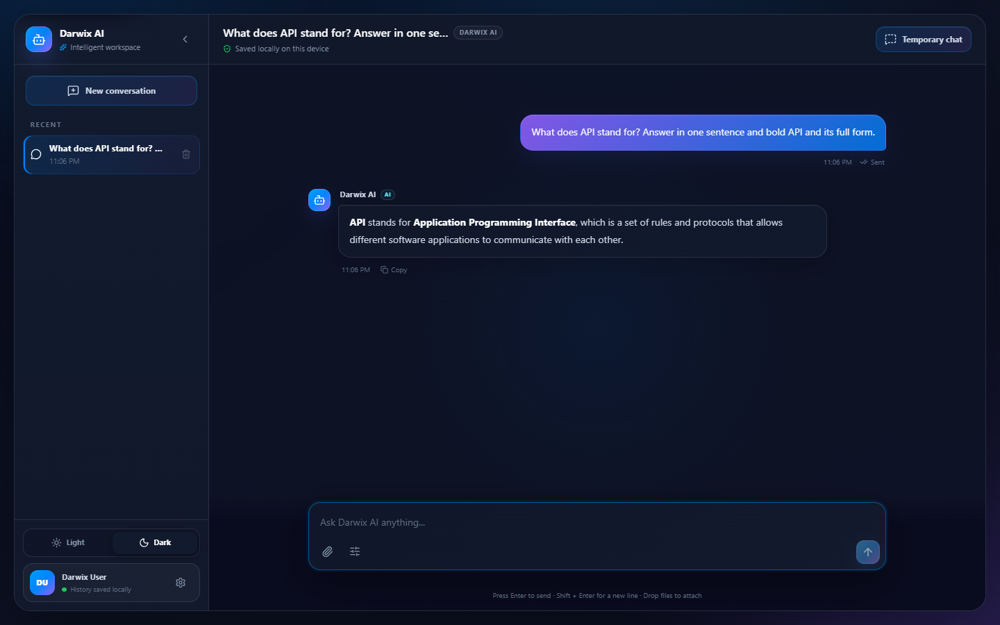
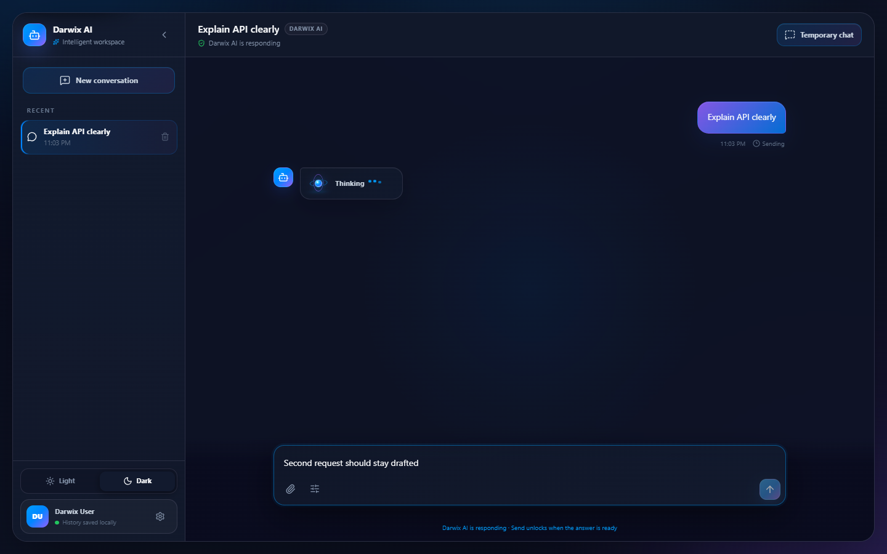
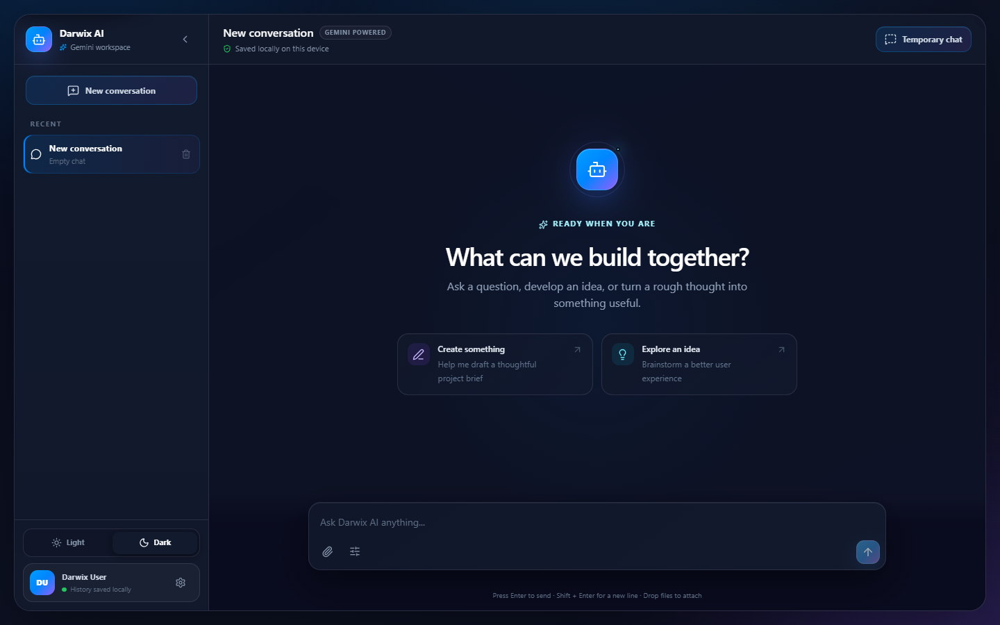
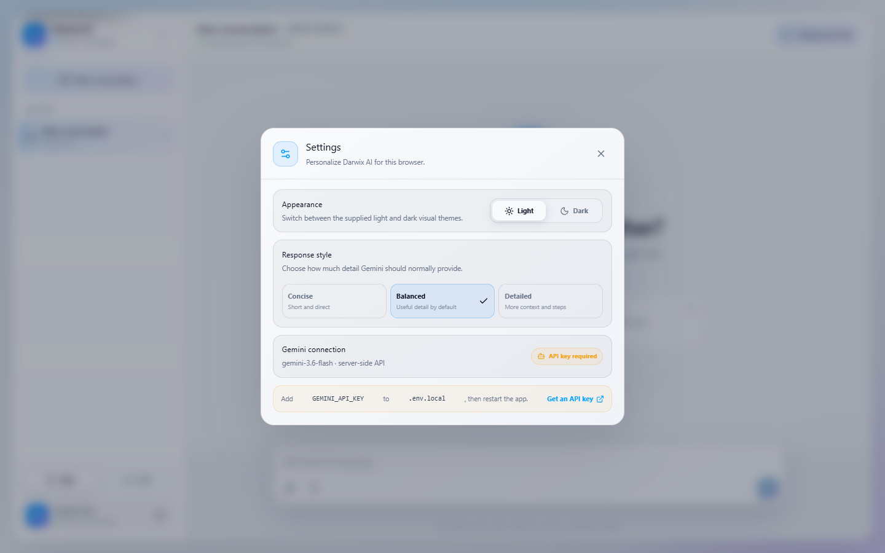
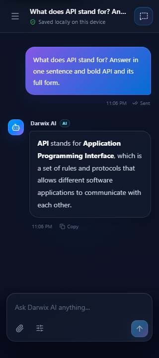
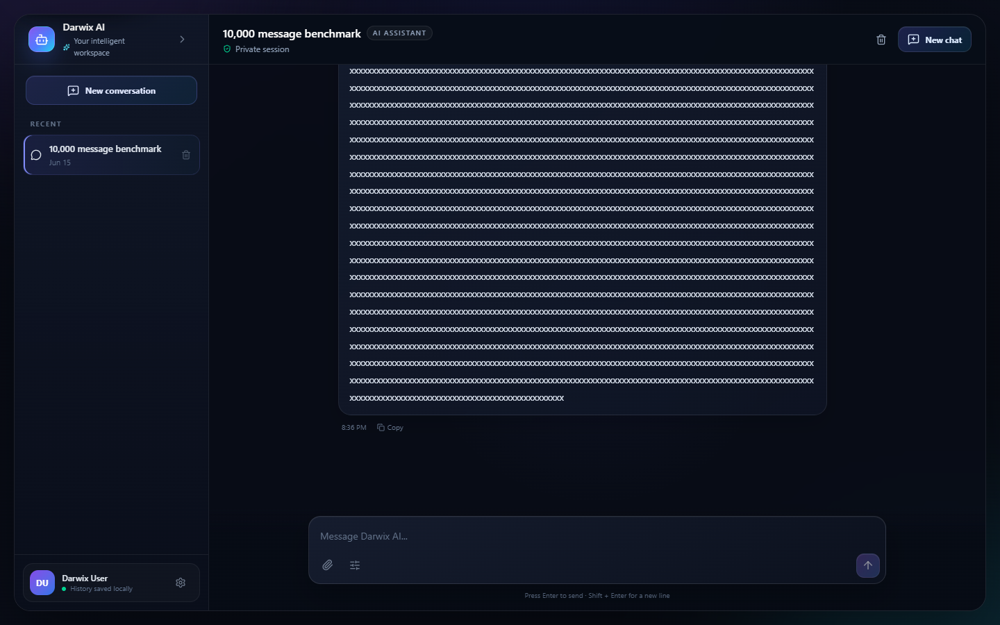
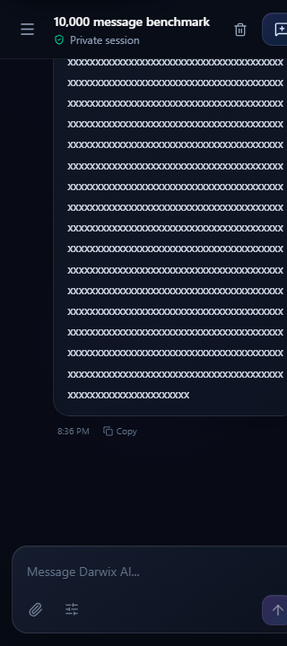
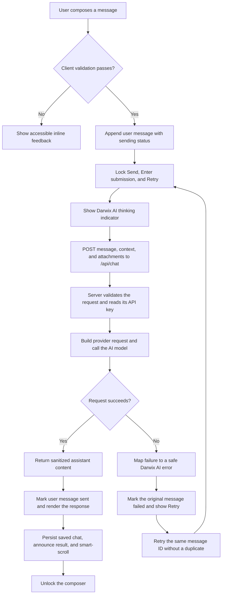

# Darwix AI Chat

Darwix AI Chat is a polished, responsive, and accessible Gemini-powered chat application built for the Darwix frontend assessment. It demonstrates a complete message lifecycle, multimodal attachments, resilient error handling, intelligent scrolling, persistent and temporary sessions, keyboard-first interaction, and efficient large-history rendering.

> Gemini calls pass through the same-origin `/api/chat` server endpoint. The API key is read from the server environment and is never bundled into browser JavaScript.

## Submission

| Deliverable | Location |
| --- | --- |
| Source repository | [Mayank2142/SmartChat](https://github.com/Mayank2142/SmartChat) |
| Screenshots | [Product tour](#product-tour) |
| Implementation documentation | [Project structure](#project-structure) and [end-to-end flow](#end-to-end-flow) |
| Live demo | [smart-chat-green.vercel.app](https://smart-chat-green.vercel.app/) |
| Local setup | Follow [Local setup](#local-setup) to run the complete application |

## Product tour

### Conversation experience

| Clean Markdown response | Thinking state and request lock |
| --- | --- |
|  |  |

The conversation view keeps user and assistant messages visually distinct, renders structured answers without exposing raw Markdown markers, and makes the active response state clear.

### Light theme, dark theme, and settings

| Dark theme | Light theme | Working settings dialog |
| --- | --- | --- |
|  |  |  |

Both themes use the Darwix blue-to-purple palette, restrained glass surfaces, visible focus treatment, and the same responsive layout behavior.

### Mobile responsiveness and large histories

| 320px mobile conversation | Desktop large-history view | Mobile large-history view |
| --- | --- | --- |
|  |  |  |

The composer stays reachable at narrow widths, navigation moves into a mobile drawer, and progressive history loading bounds the number of mounted message elements.

## Features

- Responsive light and dark themes using the supplied blue, purple, alabaster, cod-gray, and prelude palette
- Distinct user and assistant messages with accessible timestamps and delivery states
- Clean semantic Markdown rendering for headings, emphasis, lists, links, and code without leaking raw formatting markers
- Auto-growing multi-line composer with Enter to send and Shift + Enter for a newline
- Input normalization, 4,000-character limit, counter, and a global single-flight request lock
- Live Google Gemini Interactions API responses with conversation context and configurable response detail
- Image, PDF, text, CSV, audio, and video attachments with validation, previews, removal, drag-and-drop, and multimodal delivery
- Temporary chats that are clearly identified and never written to saved history
- Sending, sent, failed, and retrying states with cancellation and retry without duplication
- Smart auto-scroll that follows new content only while the reader is near the bottom
- Keyboard-accessible Jump to latest control when the reader is viewing older content
- Multiple saved sessions with automatic titles, switching, deletion, collapsible desktop navigation, and a mobile drawer
- Provider-neutral Darwix AI branding throughout the user-facing interface
- Working settings for theme, response style, and the secure Darwix AI connection status
- Versioned LocalStorage history with validation, interrupted-request recovery, and storage-failure fallback
- Copy action for bot responses with non-disruptive success or failure feedback
- Progressive history loading designed for conversations containing thousands of messages
- Reduced-motion, reduced-transparency, forced-colors, safe-area, and small-screen support
- Three restrained motion systems: directional message entrance, a state-driven 3D thinking orb, and composer/send feedback

## Tech stack

- React 19 and TypeScript 6
- Vite 8
- Tailwind CSS 4 plus component-focused custom CSS
- Lucide React icons
- Vitest, React Testing Library, user-event, and axe-core
- Playwright CLI for real-browser auditing
- GitHub Actions for continuous integration
- Vercel configuration for the Vite frontend and secure serverless Gemini endpoint

No state-management, animation, or virtualization library is required.

## Project structure

```text
darwix-ai-chat/
├── .github/workflows/ci.yml       # Lint, test, and production-build quality gate
├── api/chat.ts                    # Vercel serverless POST /api/chat entry point
├── server/gemini.ts               # Validation and server-only Google AI adapter
├── public/                        # Favicon and crawler metadata
├── src/
│   ├── components/
│   │   ├── AppHeader.tsx          # Header and navigation controls
│   │   ├── ChatComposer.tsx       # Multiline input, attachments, and send state
│   │   ├── ChatMessage.tsx        # User/assistant row and delivery actions
│   │   ├── MarkdownMessage.tsx    # Safe semantic response rendering
│   │   ├── MessageList.tsx        # Accessible log and progressive history window
│   │   ├── SessionSidebar.tsx     # Saved and temporary chat navigation
│   │   ├── SettingsDialog.tsx     # Theme, response style, and connection status
│   │   └── TypingIndicator.tsx    # Darwix AI thinking state and 3D orb
│   ├── hooks/
│   │   ├── useChatSessions.ts     # Sessions, single-flight requests, and retry
│   │   ├── useAutoScroll.ts       # Follow-latest and scroll-position preservation
│   │   ├── useLocalStorage.ts     # Debounced, resilient session persistence
│   │   └── useAppPreferences.ts   # Theme and response-style preferences
│   ├── services/chatService.ts    # Browser client for the same-origin API
│   ├── types/chat.ts              # Message, attachment, and session contracts
│   ├── utils/                     # Attachment, date, message, and storage helpers
│   ├── test/setup.ts              # Shared Vitest browser environment
│   ├── App.tsx                    # Application shell and feature composition
│   ├── index.css                  # Responsive themes, glass UI, and motion system
│   └── main.tsx                   # React application entry point
├── output/playwright/             # Versioned assessment screenshots
├── .env.example                   # Server environment variable template
├── vercel.json                    # Deployment and security-header configuration
├── vite.config.ts                 # Vite app and local API middleware
├── vitest.config.ts               # Unit, integration, and accessibility tests
└── package.json                   # Scripts and dependencies
```

`useChatSessions` owns session state and the asynchronous request lifecycle. UI components receive narrow props and remain focused on presentation and interaction. The browser service sends validated requests only to `/api/chat`; the server adapter builds the multimodal provider input and keeps credentials outside the client bundle.

## End-to-end flow



1. **Compose and validate:** The auto-growing textarea accepts multiple lines. Enter submits, Shift + Enter adds a newline, and the client validates trimmed content, length, attachment count, type, and total size.
2. **Optimistic message state:** A valid message is immediately appended with a stable ID and `sending` state. The global single-flight lock disables Send, keyboard submission, and Retry while leaving the textarea available for the next draft.
3. **Secure browser request:** `chatService` sends the message, bounded conversation context, response preference, and supported attachment data to the same-origin `POST /api/chat` endpoint. No provider credential is present in browser code.
4. **Server processing:** The server validates the payload again, reads `GEMINI_API_KEY` from its environment, converts history and attachments into multimodal model input, and calls the configured AI model.
5. **Successful response:** The server returns assistant text, the original user message becomes `sent`, and a Darwix AI message replaces the thinking indicator. Semantic Markdown, timestamp details, screen-reader announcements, smart scrolling, and saved-session persistence update together.
6. **Failure and retry:** Network, configuration, rate-limit, and invalid-response failures are converted to provider-neutral messages. The original message becomes `failed`; Retry reuses its ID and content so the transcript never gains a duplicate.
7. **Session behavior:** Requests remain attached to their originating session if the user switches chats. Saved sessions are restored from versioned LocalStorage, while temporary sessions are clearly labeled and are never written to history.
8. **Large-history behavior:** Only the latest bounded message window mounts initially. Loading an older batch preserves the reader's visual position, while new responses follow automatically only when the reader is already near the bottom.

Clearing or deleting a session aborts only that session's active request. A draft typed while waiting is preserved and becomes sendable as soon as the current request reaches success or failure.

## Motion and response feedback

New user and assistant messages use a short transform-and-opacity entrance from their respective side. While the assistant is working, a compact CSS 3D knowledge orb and sequential dots appear inside the assistant response row; the indicator is replaced by the finished response. Focus, hover, and press feedback use the same short easing curve. All non-essential motion is removed under `prefers-reduced-motion`, and no animation changes layout dimensions.

## Smart scrolling

`useAutoScroll` measures the reader's distance from the bottom using a 120px threshold. New content follows automatically only when the reader is near the latest message. Otherwise, the scroll position is preserved and Jump to latest appears. Session changes intentionally reset to the newest message, and reduced-motion users receive instant scrolling.

Loading older history records the current `scrollHeight` and `scrollTop`, prepends the next bounded batch, then offsets the scroll position by the added height. This keeps the previously visible content anchored.

## Persistence

Saved chat data is stored in LocalStorage because the assessment does not require accounts or cloud sync. The payload contains a schema version, active session ID, session metadata, attachment metadata, messages, timestamps, and delivery states.

- Data is validated before restoration.
- Corrupted or incompatible payloads fall back to a fresh session.
- Messages interrupted by a reload become failed and remain retryable.
- Quota, privacy-mode, and unavailable-storage errors fall back to in-memory use.
- Writes occur only after meaningful chat changes, are debounced, and use browser idle time when available.
- Draft text, hover state, open dialogs, and other transient UI state are not persisted.
- Temporary conversations and raw attachment bytes are never persisted.

LocalStorage is not secure storage; users should not enter sensitive information.

## Gemini, error, and retry strategy

The server validates message length, history size, attachment type/count/size, methods, Gemini configuration, upstream status, and response content. A failed message retains its original content and ID. Retry is locked while any request is active, updates that same message to `retrying`, and never appends a duplicate user message. Provider details remain internal; rate-limit, configuration, authentication, invalid-response, and network errors use clear Darwix AI language without crashing the application.

## Accessibility

- Semantic header, main, navigation, form, log, list, article, button, and textarea elements
- Accessible names for icons and status indicators
- Skip links for the conversation and composer
- Keyboard-accessible timestamp details and copy/retry controls
- Targeted live regions for bot responses, typing, delivery errors, and copy feedback
- Modal dialog and mobile drawer focus traps, Escape handling, inert backgrounds, and focus restoration
- Visible `:focus-visible` indicators and logical tab order
- Statuses identified by text and icons instead of color alone
- Reduced-motion, reduced-transparency, and Windows forced-colors support

Automated axe audits report zero violations in the default, confirmation-dialog, mobile-drawer, and large-history states. Browser smoke audits also pass in Chromium, installed Microsoft Edge, and Playwright Firefox. Keyboard behavior was checked in a real browser because automated audits alone cannot validate focus usability.

## Performance strategy

- `React.memo` prevents unchanged message rows and the message list from rerendering while composing.
- Stable message IDs are used as React keys; array indexes are never used as keys.
- Only the latest 160 messages are mounted initially. Older history is added in stable 160-message batches on request.
- Appended responses extend the current window so a reader's oldest visible message is not removed.
- Persistence is debounced and scheduled during idle time where supported.
- Expensive blur is limited to major containers and reduced on mobile.
- Motion uses GPU-friendly `transform` and `opacity`; the 3D indicator is CSS-only and exists only during an active response.
- Long unbroken content uses safe wrapping and cannot widen the document.

The project intentionally uses progressive windowing instead of variable-height virtualization. It keeps every displayed message in normal document flow, which preserves accessibility, retry controls, timestamps, and smart-scroll behavior while bounding the DOM size.

Automated tests cover 500, 1,000, 5,000, and 10,000-message datasets. A disposable real-browser benchmark at 320px restored 10,000 persisted messages in approximately 1.4 seconds on the development machine, mounted 160 message articles, produced no horizontal overflow, and safely wrapped a 4,000-character unbroken response. Timing varies by device and browser.

## Testing

```bash
npm run check
```

The combined command runs the same lint, test, and build quality gate used by CI. Individual commands remain available:

```bash
npm run test
npm run lint
npm run build
```

The 45-test suite covers composition, attachments, Gemini request contracts, clean Markdown rendering and announcements, the global request lock and draft preservation, keyboard behavior, success and failure lifecycles, retries, timestamps, focus management, themes, settings, temporary sessions, smart scrolling, persistence recovery, storage failure, session actions, copy feedback, axe accessibility, scroll anchoring, and the large-history matrix.

Real-browser checks include 320×720, 375×812, 768×1024, 1024×768, and 1440×900 Chromium viewports plus desktop smoke checks in Microsoft Edge and Firefox. They verify horizontal overflow, composer visibility, responsive navigation, keyboard focus wrapping, skip navigation, axe results, console errors, long-message wrapping, and large-history rendering.

## Local setup

Requirements: Node.js 20.19+ or 22.12+ and npm.

```bash
npm install
Copy-Item .env.example .env.local
# Replace the placeholder with a Gemini API key from Google AI Studio.
npm run dev
```

The local Vite middleware and deployed Vercel function both read `GEMINI_API_KEY`. `GEMINI_MODEL` is optional and defaults to `gemini-3.6-flash`. Vite prints the local development URL. For a frontend-only production preview:

```bash
npm run build
npm run preview
```

## Assumptions and limitations

- A Google AI Studio Gemini API key is required for live responses; without it, the UI shows a retryable configuration error.
- History belongs to one browser profile and is not synchronized between devices.
- LocalStorage capacity varies, so extremely large histories may eventually switch to in-memory mode.
- Attachments are limited to three files and 3 MB total per request so they remain below common serverless request limits.
- Safari/WebKit and physical iOS/Android devices were not available in this local environment and should receive a final smoke test before public deployment.
- The source repository is published at [github.com/Mayank2142/SmartChat](https://github.com/Mayank2142/SmartChat), and the production deployment is available at [smart-chat-green.vercel.app](https://smart-chat-green.vercel.app/).

## Deployment

The repository includes a schema-validated `vercel.json` configuration with the Vite build command, static output directory, serverless API discovery, Content Security Policy, clickjacking protection, MIME sniffing protection, privacy-oriented permissions, and referrer controls.

Every push or pull request to `main` runs the GitHub Actions quality workflow using Node.js 22 and a clean `npm ci` install.

The repository is configured for the following publication flow:

```bash
git push origin main
npx vercel env add GEMINI_API_KEY
npx vercel --prod
```

The source code and versioned screenshots are available in the [SmartChat repository](https://github.com/Mayank2142/SmartChat). The working production deployment is [smart-chat-green.vercel.app](https://smart-chat-green.vercel.app/); it reads `GEMINI_API_KEY` only from the secure Vercel environment.
