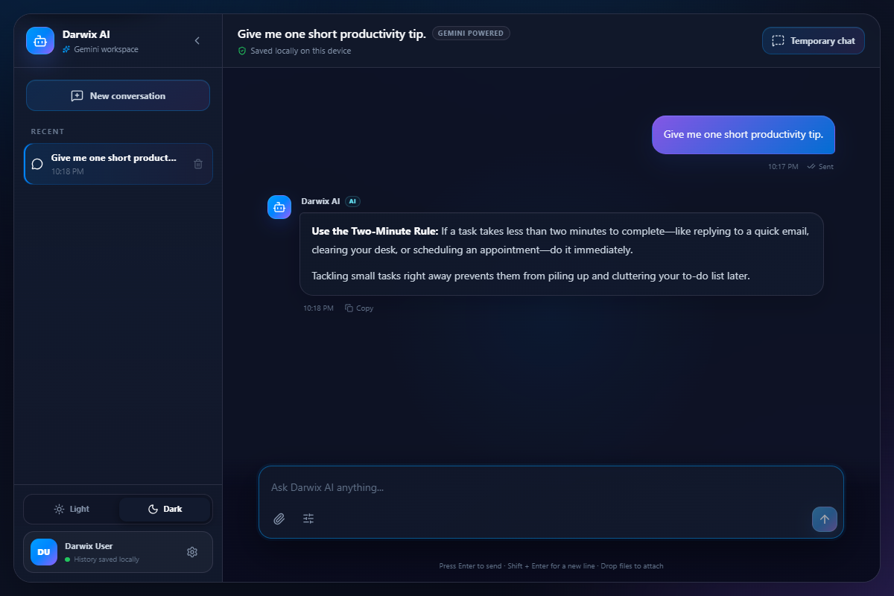
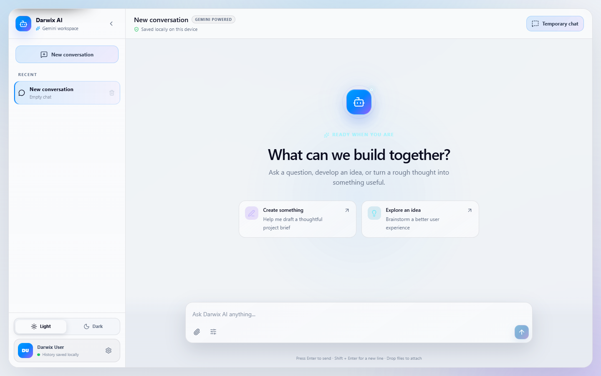
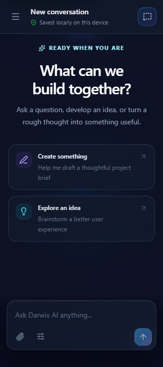

# Darwix AI Chat

Darwix AI Chat is a polished, responsive, and accessible Gemini-powered chat application built for the Darwix frontend assessment. It demonstrates a complete message lifecycle, multimodal attachments, resilient error handling, intelligent scrolling, persistent and temporary sessions, keyboard-first interaction, and efficient large-history rendering.

> Gemini calls pass through the same-origin `/api/chat` server endpoint. The API key is read from the server environment and is never bundled into browser JavaScript.

## Screenshots

| 1440px dark theme | 1440px light theme | 320px mobile |
| --- | --- | --- |
|  |  |  |

## Features

- Responsive light and dark themes using the supplied blue, purple, alabaster, cod-gray, and prelude palette
- Distinct user and assistant messages with accessible timestamps and delivery states
- Auto-growing multi-line composer with Enter to send and Shift + Enter for a newline
- Input normalization, 4,000-character limit, counter, and duplicate-submit protection
- Live Google Gemini Interactions API responses with conversation context and configurable response detail
- Image, PDF, text, CSV, audio, and video attachments with validation, previews, removal, drag-and-drop, and multimodal delivery
- Temporary chats that are clearly identified and never written to saved history
- Sending, sent, failed, and retrying states with cancellation and retry without duplication
- Smart auto-scroll that follows new content only while the reader is near the bottom
- Keyboard-accessible Jump to latest control when the reader is viewing older content
- Multiple saved sessions with automatic titles, switching, deletion, collapsible desktop navigation, and a mobile drawer
- Working settings for theme, response style, and Gemini connection status
- Versioned LocalStorage history with validation, interrupted-request recovery, and storage-failure fallback
- Copy action for bot responses with non-disruptive success or failure feedback
- Progressive history loading designed for conversations containing thousands of messages
- Reduced-motion, reduced-transparency, forced-colors, safe-area, and small-screen support

## Tech stack

- React 19 and TypeScript 6
- Vite 8
- Tailwind CSS 4 plus component-focused custom CSS
- Lucide React icons
- Vitest, React Testing Library, user-event, and axe-core
- Playwright CLI for real-browser auditing
- GitHub Actions for continuous integration
- Vercel configuration for the Vite frontend and secure serverless Gemini endpoint

No state-management, animation, or virtualization library is required.

## Architecture

```text
src/
  components/   Shell, navigation, messages, composer, dialogs, and controls
  hooks/        Sessions, preferences, persistence, smart scroll, and announcements
  services/     Browser-side same-origin Gemini client
  types/        Chat, message, session, and persistence contracts
  utils/        Attachments, date, message, and versioned storage helpers
  test/         Shared browser-like test setup
api/            Vercel `/api/chat` function
server/         Validated Gemini Interactions API adapter shared with local Vite
```

`useChatSessions` owns session state and the asynchronous request lifecycle. UI components receive narrow props and remain focused on presentation and interaction. The browser service sends validated requests only to `/api/chat`; the server adapter builds the Gemini multimodal input and keeps credentials outside the client bundle.

## Message lifecycle

```text
Compose → validate → append user message as sending → show typing
        → request succeeds → mark user message sent → append bot response

        → request fails → mark the same message failed → expose Retry
        → retrying → reuse the original message ID → sent or failed
```

Each request is registered against its originating session. Switching sessions does not move an in-flight response. Clearing or deleting a session aborts only that session's requests.

## Smart scrolling

`useAutoScroll` measures the reader's distance from the bottom using a 120px threshold. New content follows automatically only when the reader is near the latest message. Otherwise, the scroll position is preserved and Jump to latest appears. Session changes intentionally reset to the newest message, and reduced-motion users receive instant scrolling.

Loading older history records the current `scrollHeight` and `scrollTop`, prepends the next bounded batch, then offsets the scroll position by the added height. This keeps the previously visible content anchored.

## Persistence

Saved chat data is stored in LocalStorage because the assessment does not require accounts or cloud sync. The payload contains a schema version, active session ID, session metadata, attachment metadata, messages, timestamps, and delivery states.

- Data is validated before restoration.
- Corrupted or incompatible payloads fall back to a fresh session.
- Messages interrupted by a reload become failed and remain retryable.
- Quota, privacy-mode, and unavailable-storage errors fall back to in-memory use.
- Writes occur only after meaningful chat changes, are debounced, and use browser idle time when available.
- Draft text, hover state, open dialogs, and other transient UI state are not persisted.
- Temporary conversations and raw attachment bytes are never persisted.

LocalStorage is not secure storage; users should not enter sensitive information.

## Gemini, error, and retry strategy

The server validates message length, history size, attachment type/count/size, methods, Gemini configuration, upstream status, and response content. A failed message retains its original content and ID. Retry is locked while active, updates that same message to `retrying`, and never appends a duplicate user message. Rate-limit, configuration, authentication, invalid-response, and network errors surface as actionable messages without crashing the application.

## Accessibility

- Semantic header, main, navigation, form, log, list, article, button, and textarea elements
- Accessible names for icons and status indicators
- Skip links for the conversation and composer
- Keyboard-accessible timestamp details and copy/retry controls
- Targeted live regions for bot responses, typing, delivery errors, and copy feedback
- Modal dialog and mobile drawer focus traps, Escape handling, inert backgrounds, and focus restoration
- Visible `:focus-visible` indicators and logical tab order
- Statuses identified by text and icons instead of color alone
- Reduced-motion, reduced-transparency, and Windows forced-colors support

Automated axe audits report zero violations in the default, confirmation-dialog, mobile-drawer, and large-history states. Browser smoke audits also pass in Chromium, installed Microsoft Edge, and Playwright Firefox. Keyboard behavior was checked in a real browser because automated audits alone cannot validate focus usability.

## Performance strategy

- `React.memo` prevents unchanged message rows and the message list from rerendering while composing.
- Stable message IDs are used as React keys; array indexes are never used as keys.
- Only the latest 160 messages are mounted initially. Older history is added in stable 160-message batches on request.
- Appended responses extend the current window so a reader's oldest visible message is not removed.
- Persistence is debounced and scheduled during idle time where supported.
- Expensive blur is limited to major containers and reduced on mobile.
- Long unbroken content uses safe wrapping and cannot widen the document.

The project intentionally uses progressive windowing instead of variable-height virtualization. It keeps every displayed message in normal document flow, which preserves accessibility, retry controls, timestamps, and smart-scroll behavior while bounding the DOM size.

Automated tests cover 500, 1,000, 5,000, and 10,000-message datasets. A disposable real-browser benchmark at 320px restored 10,000 persisted messages in approximately 1.4 seconds on the development machine, mounted 160 message articles, produced no horizontal overflow, and safely wrapped a 4,000-character unbroken response. Timing varies by device and browser.

## Testing

```bash
npm run check
```

The combined command runs the same lint, test, and build quality gate used by CI. Individual commands remain available:

```bash
npm run test
npm run lint
npm run build
```

The 42-test suite covers composition, attachments, Gemini request contracts, Markdown rendering, keyboard behavior, success and failure lifecycles, retries, timestamps, announcements, focus management, themes, settings, temporary sessions, smart scrolling, persistence recovery, storage failure, session actions, copy feedback, axe accessibility, scroll anchoring, and the large-history matrix.

Real-browser checks include 320×720, 375×812, 768×1024, 1024×768, and 1440×900 Chromium viewports plus desktop smoke checks in Microsoft Edge and Firefox. They verify horizontal overflow, composer visibility, responsive navigation, keyboard focus wrapping, skip navigation, axe results, console errors, long-message wrapping, and large-history rendering.

## Local setup

Requirements: Node.js 20.19+ or 22.12+ and npm.

```bash
npm install
Copy-Item .env.example .env.local
# Replace the placeholder with a Gemini API key from Google AI Studio.
npm run dev
```

The local Vite middleware and deployed Vercel function both read `GEMINI_API_KEY`. `GEMINI_MODEL` is optional and defaults to `gemini-3.6-flash`. Vite prints the local development URL. For a frontend-only production preview:

```bash
npm run build
npm run preview
```

## Assumptions and limitations

- A Google AI Studio Gemini API key is required for live responses; without it, the UI shows a retryable configuration error.
- History belongs to one browser profile and is not synchronized between devices.
- LocalStorage capacity varies, so extremely large histories may eventually switch to in-memory mode.
- Attachments are limited to three files and 3 MB total per request so they remain below common serverless request limits.
- Safari/WebKit and physical iOS/Android devices were not available in this local environment and should receive a final smoke test before public deployment.
- Repository and live deployment URLs have not been published yet; add them here before assessment submission.

## Deployment

The repository includes a schema-validated `vercel.json` configuration with the Vite build command, static output directory, serverless API discovery, Content Security Policy, clickjacking protection, MIME sniffing protection, privacy-oriented permissions, and referrer controls.

Every push or pull request to `main` runs the GitHub Actions quality workflow using Node.js 22 and a clean `npm ci` install.

After authenticating the required services, the intended publication flow is:

```bash
gh auth login -h github.com
gh repo create darwix-ai-chat --public --source=. --remote=origin --push
npx vercel env add GEMINI_API_KEY
npx vercel --prod
```

No live URL has been published from the current environment because its saved GitHub credential is invalid and no Vercel account is configured. Replace this paragraph with the repository and deployment links after authentication.
